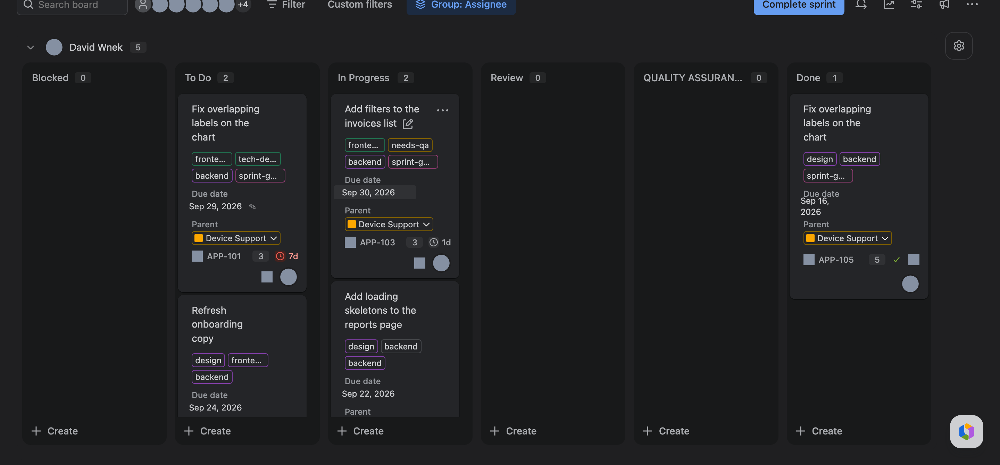
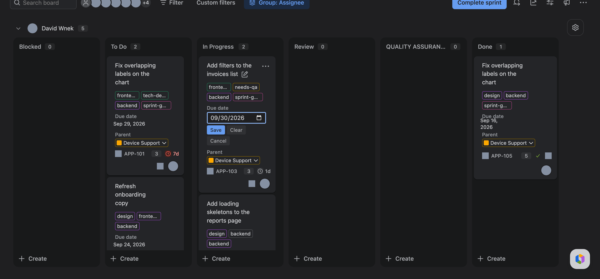
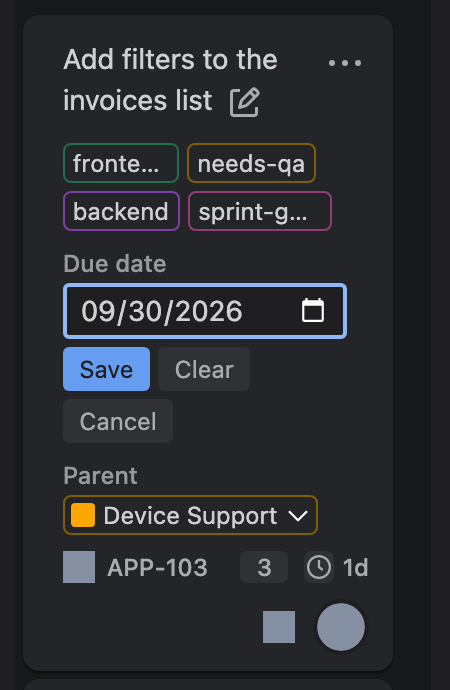

# Jira Tweaks

Chrome extension with two tweaks for teams running a shared board with a client:

1. **Editable due date** on Jira board issue panels (Active Sprints / backlog side panel)
   where Jira renders it read-only.
2. **A back-link row** under **Parent** on the client's issues, pointing at the matching
   ticket on your own board.

Both work through Jira's own REST API using your existing login session. No tokens.

## Screenshots

Board cards show the due date but only let you edit the summary inline. With the extension, the date
gets a pencil on hover and opens a picker on click. Screenshots are from a real board with keys,
titles, labels and parent renamed.

| Hover | Editor open |
| --- | --- |
|  |  |



## Install (unpacked)

1. Open `chrome://extensions`.
2. Turn on **Developer mode** (top right).
3. Click **Load unpacked** and pick this folder.
4. Reload your Jira board tab.

## Use: editable due date

On the board, hover a card's Due date value, click it, pick a date, then **Save** (or press Enter).
**Clear** removes the due date. **Cancel** / Esc backs out. The same works anywhere Jira shows a
read-only "Due date" label next to a value, such as an older issue detail panel. Where Jira already
renders its own inline editor (the modern issue view), the extension leaves the field alone.

## Use: back-link to your own board

Two boards on two Atlassian sites: yours (say `WC4`) and the client's (`PLS`). Automation on your
side can link a `WC4` ticket to its `PLS` counterpart, but the client's site can't link back. The
link does exist in the data, though - your ticket summaries start with the client key:

```
WC4-812   PLS-4567/Rework the widget pipeline
```

So on a `PLS` issue the extension searches your board for that key and renders the missing row
itself, right under **Parent**:

```
Parent        PLS-4000  Client epic
Caxy ticket   WC4-812   Rework the widget pipeline
Status        In Progress
```

Open the extension's **Options** to set it up:

| Field | Example | What it does |
| --- | --- | --- |
| Your Jira site | `https://yourco.atlassian.net` | The site holding your internal projects. One site for all mappings. |
| Project mappings | `PLS` -> `WC4` | One of your projects per client project - see below. |
| Row label | `Caxy ticket` | Text shown in place of "Parent" on the row. |

### Project mappings

Each client project maps to exactly one of yours:

| Client project | Your project |
| --- | --- |
| `PLS` | `WC4` |
| `ACME` | `WC5` |

The row appears only on issues in a client project listed here, and searches the project it maps to -
a `PLS` issue looks in `WC4`, an `ACME` issue looks in `WC5`. Your own board is never in the left
column, so the row never appears there. Two client projects may point at the same project of yours;
a client project can't be listed twice.

Upgrading from 0.2 (one internal project, a comma-separated list of client projects) needs nothing:
those settings are folded into the table the first time they are read, and dropped on the next save.

The **Test a lookup** box on the options page runs a real search for one key and prints the mapping
it resolved plus what came back - use it to confirm the summary convention matches before wondering
why a row is empty.

### How the match works

For a `PLS-4567` issue the service worker resolves the mapping (`PLS` -> `WC4`), then runs
`project = "WC4" AND summary ~ "\"PLS-4567\""` against your site, then
keeps only a result whose summary actually starts with the client key. The quoting matters: Jira
tokenizes `PLS-4567/Rework...` on the punctuation, so an unquoted `~` match would also hit
`PLS-45670`.

If the lookup can't run - you're not signed in to your site in this browser, or it isn't configured -
the row degrades to a link that opens that same JQL in your site's issue navigator, rather than
disappearing. Hover it for the reason.

### Caveats

- **Nothing is written to the client's Jira.** The row is drawn by the extension in your browser and
  the only request it makes is a search on *your* site. The client's issue is never modified,
  commented on or linked.
- It is **not** a real Jira field: nobody without the extension installed and configured sees it, and
  it doesn't appear in exports, the API or email notifications.
- It's a plain read-only link. Editing it isn't a thing; change the ticket summary on your board.
- The row is cloned from Jira's own Parent row so it inherits the surrounding styling. If Jira
  restructures the details panel and the Parent row can't be found, the row is skipped silently
  (turn on debug logging below to see that).

## Self-hosted Jira

The manifest only targets `*.atlassian.net` and `*.jira.com`. For Jira Server / Data Center,
add your host to `content_scripts[0].matches` in `manifest.json`, e.g. `"https://jira.example.com/*"`,
then reload the extension. If it's your *internal* site that is self-hosted, the options page
notices the missing host permission and offers a **Grant access** button instead.

## Debugging

In the page console run `localStorage.jiraTweaksDebug = '1'` and reload. The script logs which
elements it enhances or skips. For the service worker, run
`chrome.storage.local.set({ jtDebug: true })` from its console on `chrome://extensions`.

`test/mock.html` is a stand-alone page with a fake REST API and a fake back-link lookup, for trying
the UI without a real Jira. Serve the folder (`python3 -m http.server 8765`) and open
`test/mock.html?selectedIssue=PLS-4567`; the links at the top switch between two mappings
(`PLS`->`WC4`, `ACME`->`WC5`) and the no-match, lookup-failed and unmapped cases.

`node test/settings.test.js` covers the settings parsing, the 0.2 migration and the JQL quoting.

If the console says `settings.js did not load`, reload the extension at `chrome://extensions` -
adding a file to `content_scripts` needs an explicit reload.

## Caveat: due date screen config

If Jira refuses the update with "Field 'duedate' cannot be set. It is not on the appropriate screen",
the field is missing from the project's **Edit** screen. That is a project configuration issue
the REST API also enforces; a Jira admin has to add Due date to the edit screen.
